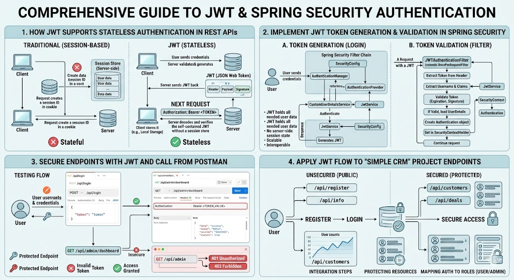

# [4.2] Spring Security Part 2: JWT Authentication & Authorization

## Lesson Overview

## Dependencies

- [Self Studies](./studies.md) / [Lesson](./lesson.md) / [Assignment](./assignment.md) / [Slide Deck](./slides.md)

## Lesson Objectives

By the end of this lesson, students will be able to:

* **Explain** how JWT supports stateless authentication in REST APIs
* **Implement** JWT token generation and validation in Spring Security
* **Secure** REST endpoints using JWT and call them from Postman
* **Apply** the same JWT flow to simple endpoints in the Simple CRM project

## Lesson Plan

| Duration | What | How or Why |
|---|---|---|
| 10 min | Warm-up | Recap Basic Auth and RBAC from Lesson 4.1 — JWT builds directly on the same Spring Security concepts |
| 15 min | Parts 1 & 2: Why JWT + Stateless Mental Model | Explain the limitations of Basic Auth; contrast session-based vs token-based authentication |
| 20 min | Parts 3 & 4: JWT Structure + End-to-End Flow | Walk through header, payload, signature; map out the full login → token → protected request flow before writing any code |
| 10 min | Part 5: Create `jwt-demo` project + add dependencies | Project setup; explain jjwt 0.11.5 version choice and secret key length requirement |
| 10 min | Part 5: DTOs + `application.properties` | Create `LoginRequest`, `TokenResponse`; configure secret and expiry |
| 20 min | Part 5: `JwtService` — generate + validate tokens | Code-along — explain `setSubject`, `setExpiration`, `signWith`, `parserBuilder`; note deprecation warning is harmless |
| 15 min | Part 5: `AuthController` + `HelloController` | Code-along — login endpoint returns token; protected endpoint has no JWT code — explain why |
| 25 min | Part 5: `JwtAuthFilter` + `SecurityConfig` | Code-along — walk through filter mental model step by step; configure stateless session + filter ordering |
| 10 min | Break | — |
| 15 min | Part 6: Postman Testing — Standalone Example | Live demo — login → copy token → 401 without token → 200 with token; make the flow visible |
| 20 min | Parts 7 & 8: Apply JWT to Simple CRM | Code-along — copy JwtService + JwtAuthFilter into CRM; update SecurityConfig; test GET /customers with and without token |
| 20 min | Activity — Full JWT Flow in Simple CRM | Students independently complete the JWT flow for two CRM endpoints using Postman |
| 10 min | Wrap-up | Recap stateless auth, filter chain, SecurityContext, and why the controller never needs JWT code |
| **200 min** | **Total** | |